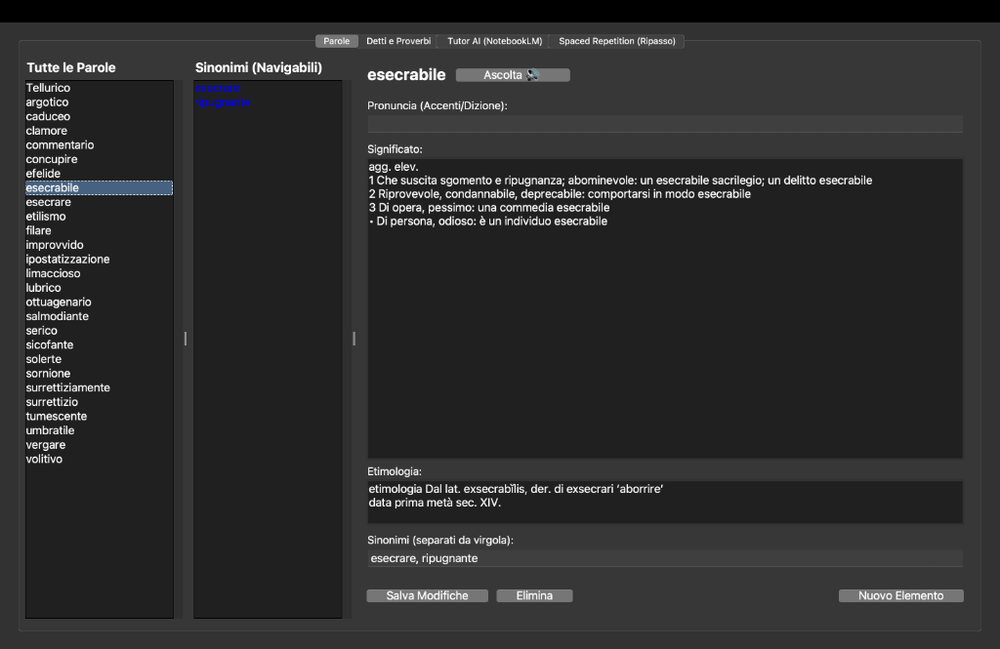

# Verba 🗣️📚

**Verba** è un'applicazione desktop premium e leggera per macOS, sviluppata in Python (Tkinter), progettata per l'apprendimento avanzato di vocaboli, detti e proverbi italiani. Lo strumento unisce la memorizzazione attiva tramite l'algoritmo di **Spaced Repetition SM-2**, la **sintesi vocale nativa** per perfezionare la dizione e l'integrazione con **Google NotebookLM** per sessioni di quiz interattivi con tutor AI.

Tutti i vocaboli e i detti sono sincronizzati localmente in note Markdown con frontmatter YAML e collegamenti Wikilink, pronti per essere esplorati come un cervello digitale visivo all'interno di **Obsidian**.



---

## 🌟 Funzionalità Principali

1. **Gestione del Vocabolario & Detti**:
   - Schede separate e dedicate per **Parole** e **Detti e Proverbi**.
   - Campi strutturati per Significato, Etimologia, Sinonimi/Detti Simili e Pronuncia con accenti tonici.
   - Navigazione ipertestuale immediata cliccando sui sinonimi o sui detti correlati.

2. **Dizionario Offline da 500.000+ Termini**:
   - Database SQLite locale pre-compilato (derivato da Wiktionary) per la ricerca istantanea.
   - Autocompilazione immediata di significato ed etimologia delle parole ricercate con un solo click.

3. **Sintesi Vocale Italiana Premium (TTS)**:
   - Pulsanti di ascolto asincroni in background che non bloccano l'interfaccia utente.
   - Utilizzo nativo della voce ad alta fedeltà **Alice** di macOS per la corretta dizione ed intonazione.
   - Pulizia automatica della sintassi Markdown prima della riproduzione vocale.

4. **Spaced Repetition (Algoritmo SM-2)**:
   - Sessioni di ripasso giornaliere calcolate automaticamente in base all'algoritmo di Anki (SuperMemo SM-2).
   - Valutazione su **Scala Likert (0-5)** orizzontale con pulsanti a colori pastello intuitivi (*Buio*, *Quasi*, *Errato*, *Fatica*, *Bene*, *Ottimo*).
   - Metadati di tracciamento (`repetitions`, `interval`, `easiness`, `next_review`) salvati direttamente nel frontmatter YAML dei file `.md`.

5. **Integrazione Obsidian (Cervello Digitale)**:
   - Generazione automatica di file Markdown pronti per Obsidian Vault nella cartella `wiki/`.
   - Connessioni semantiche reali tra le note generate tramite i Wikilink bidirezionali (`[[Sinonimo]]`).
   - Esplorazione del grafo tridimensionale delle parole e dei concetti studiati.

6. **Tutor AI con Google NotebookLM**:
   - Creazione automatica di un blocco appunti dedicato su NotebookLM contenente il proprio dizionario personalizzato.
   - Generazione automatica di quiz basati sul contesto (es. frasi a completamento con opzioni multiple generate dal vocabolario).
   - Chat interattiva in tempo reale con l'AI focalizzata esclusivamente sulle parole inserite.

---

## 📂 Struttura del Progetto

```text
verba/
├── app.py              # Entry point principale della GUI Tkinter
├── db.py               # Gestione del database SQLite locale e della sincronizzazione Markdown (Obsidian)
├── constants.py        # Definizione delle costanti di configurazione e logging
├── item_tab.py         # Modulo della scheda di editing delle parole e dei detti
├── spaced_tab.py       # Modulo della sessione di flashcard Spaced Repetition (SM-2)
├── tutor_tab.py        # Modulo dell'interfaccia interattiva Tutor AI (NotebookLM CLI)
├── tts.py              # Logica di sintesi vocale macOS (Say CLI wrapper)
├── build_dict.py       # Script helper per l'inizializzazione del database offline
├── icon.png            # Icona dell'applicazione
├── requirements.txt    # Dipendenze Python (PyYAML)
├── Vocabolario.spec    # Specifica PyInstaller per la compilazione del bundle .app
└── README.md           # Questo file di documentazione
```

---

## 🛠️ Requisiti di Sistema

- **Sistema Operativo**: macOS (raccomandato per il supporto TTS nativo della voce Alice).
- **Python**: versione `3.9` o superiore.
- **NotebookLM CLI**: La CLI ufficiale di Google NotebookLM installata sul sistema e autenticata con il proprio account per far funzionare il Tutor AI.

---

## 🚀 Installazione e Avvio Rapido

1. Clona la repository sul tuo computer:
   ```bash
   git clone https://github.com/luglistudio/verba.git
   cd verba
   ```

2. Installa le dipendenze:
   ```bash
   pip install -r requirements.txt
   ```

3. Avvia l'applicazione:
   ```bash
   python app.py
   ```

### Compilazione in App macOS Indipendente

Se desideri generare il pacchetto applicazione nativo `.app` per macOS (in modo da aprirlo con un doppio click o trovarlo in Spotlight):

1. Installa PyInstaller:
   ```bash
   pip install pyinstaller
   ```

2. Avvia la compilazione:
   ```bash
   pyinstaller Vocabolario.spec --clean
   ```

3. Troverai l'applicazione compilata all'interno della cartella `dist/Vocabolario.app`.

---

## 🛡️ Licenza

Questo progetto è rilasciato sotto la licenza **MIT**. Consulta il file `LICENSE` per ulteriori informazioni.
